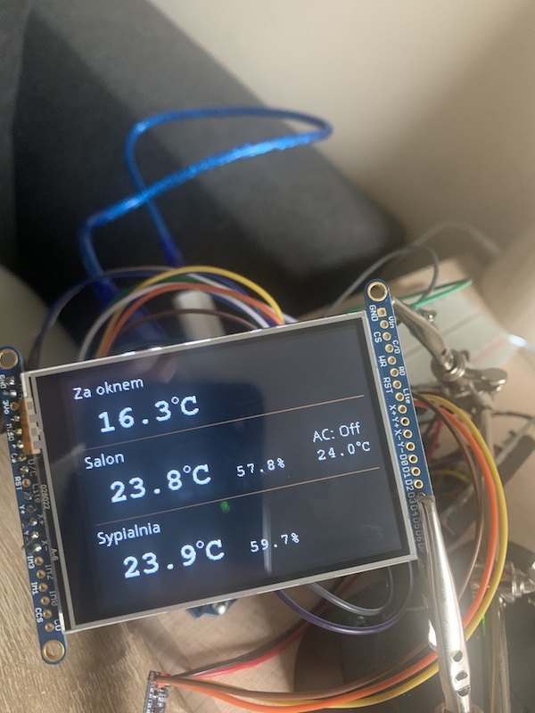
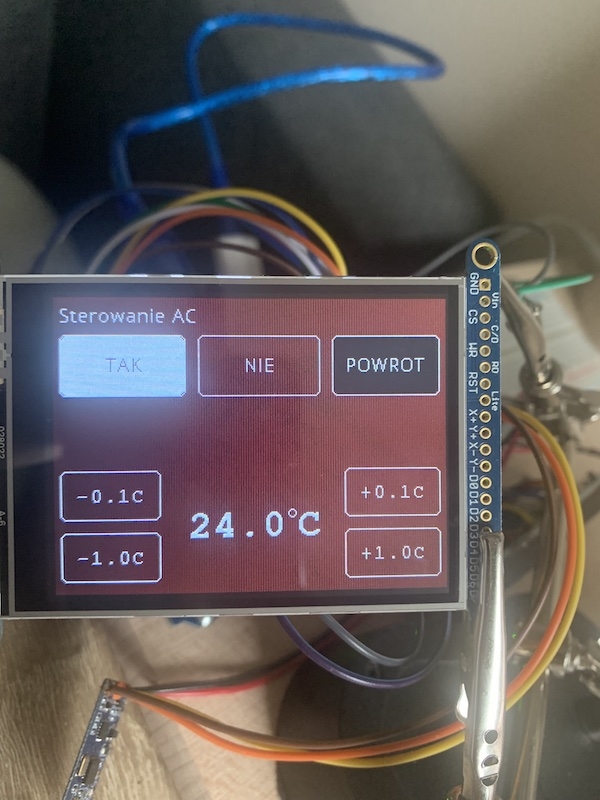

# Deprecated

This air controlling unit has been superseded by a [RaspberryPi implementation](https://github.com/ptkoz/infodisplay-controller) using same
peripherals.

# Air Conditioning Controller

A controlling unit for Air Conditioning management solution I've built around my mobile air conditioner.

## Features

* Measures primary indoor temperature and humidity using SHT-35 sensor.
* Allows configuring desired indoor temperature.
* Communicates with secondary modules (Serial communication over HC-12 433Mhz radio bridge):
    * Sends on / off commands to the [Air Conditioning Unit](https://github.com/pamelus/air-conditioning-unit) to maintain configured indoor temperature.
    * Receives information from [Secondary Sensors](https://github.com/pamelus/air-conditioning-sensor) (secondary SHT-35 indoor temperature sensor and MPC9808 outdoor
      temperature sensor) and combines them on the screen.

